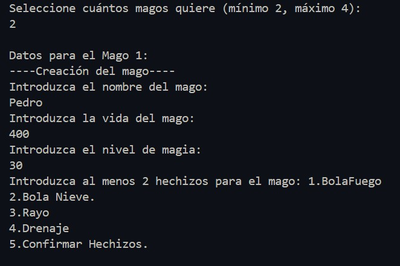
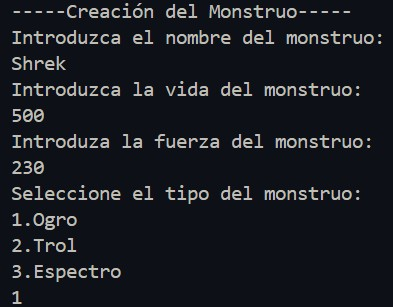
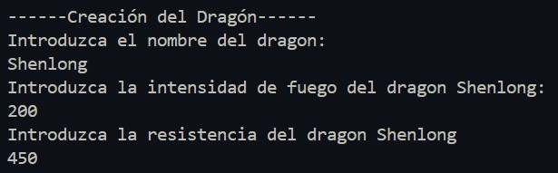
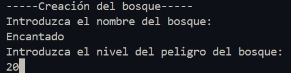
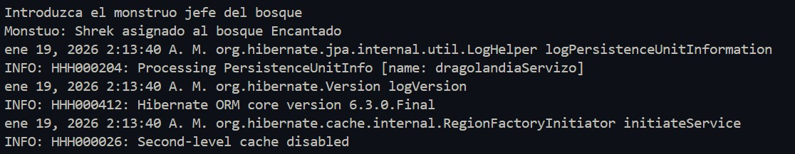
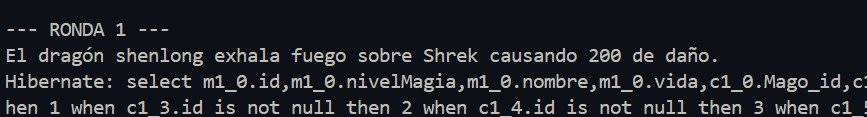
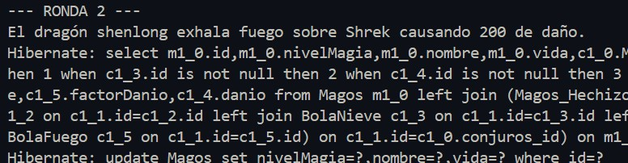
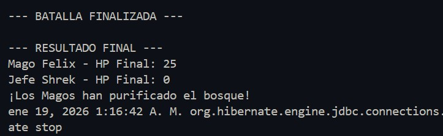

# Manual de usuario

Estemanual te explicará como funciona el programa a continuación:

## Índice
> 1. Introducción
> 2. Funcionalidades
> 3. Partida

## 1. Introducción
Este programa es la representación de un juego de magos que luchan junto al dragón para defender el bosque del Monstruo jefe y sus "monstritos"

## 2. Funcionalidades

- **Creación de Magos** \
Al ejecutar la aplicación se lre preguntará al usuario cuantos magos desea crear para su partida, dandole a escoger entre un rango de 2 como mínimo y 4 magos como máximo

 

- **Creación del Monstruo**\
A continuación nos pedirá que creemos a nuestro monstruo jefe, donde podemos definir atributos como su vida, el tipo o fuerza.

- **Creación del Dragón**\
Al igual que antes, debemos crear a nuestro dragón introduciendo sus datos por teclado :)

- **Creación del Bosque**\
Por último, antes de empezar la partida debemos crear el sitio que dará lugar a la batalla, el bosque.

- Una vez creados todos nuestros personajes hibernate se encargará de guardar cada entidad con todos los datos en tablas en la Base de datos.

## 3.Partida

Durante toda la partida el usuario no tiene que hacer nada ya que el juego está automatizado y se irá mostrando randa tras ronda lo que ocurre y a la vez se irá actualizando la vida de los personajes en la base de datos

Al final de la partida se mostrará la vida restante de los magos y del monstruo jefe, y quien o quienes fueron los vencedores.

