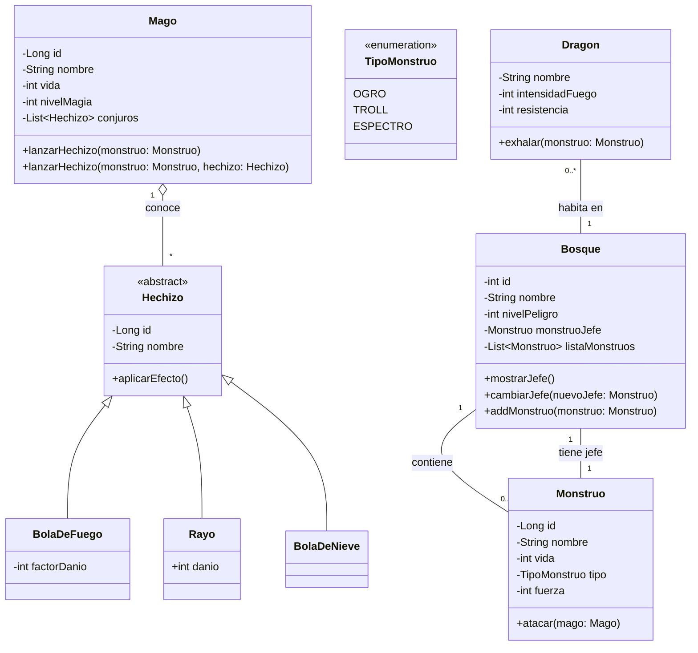

# Análisis de diseño 
## Diagrama de clases

```mermaid
classDiagram
direction TB
    class Mago {
	    -Long id
	    -String nombre
	    -int vida
	    -int nivelMagia
	    -List~Hechizo~ conjuros
	    +lanzarHechizo(monstruo: Monstruo)
	    +lanzarHechizo(monstruo: Monstruo, hechizo: Hechizo)
    }

    class Monstruo {
	    -Long id
	    -String nombre
	    -int vida
	    -TipoMonstruo tipo
	    -int fuerza
	    +atacar(mago: Mago)
    }

    class TipoMonstruo {
	    OGRO
	    TROLL
	    ESPECTRO
    }

    class Dragon {
	    -String nombre
	    -int intensidadFuego
	    -int resistencia
	    +exhalar(monstruo: Monstruo)
    }

    class Bosque {
	    -int id
	    -String nombre
	    -int nivelPeligro
	    -Monstruo monstruoJefe
	    -List~Monstruo~ listaMonstruos
	    +mostrarJefe()
	    +cambiarJefe(nuevoJefe: Monstruo)
	    +addMonstruo(monstruo: Monstruo)
    }

    class BolaDeFuego {
	    -int factorDanio
    }

    class Rayo {
	    +int danio
    }

    class BolaDeNieve {
	    
    }


    class Hechizo {
        -Long id
	    -String nombre
        +aplicarEfecto()

    }

	<<enumeration>> TipoMonstruo
	<<abstract>> Hechizo

    Mago "1" o-- "*" Hechizo : conoce
    Bosque "1" -- "0..*" Monstruo : contiene
    Bosque "1" -- "1" Monstruo : tiene jefe
    Dragon "0..*" -- "1" Bosque : habita en
    Hechizo <|-- BolaDeFuego
    Hechizo <|-- Rayo
    Hechizo <|-- BolaDeNieve

```