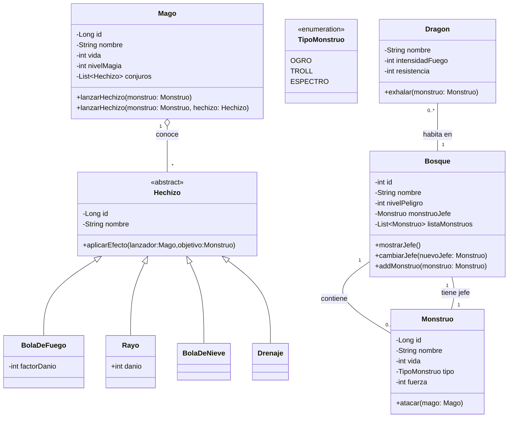

# DRAGOLANDIA

# Análisis de diseño 

## Introducción
Este proyecto es un juego de peleas entre Magos y Monstruos, donde utilizamos usamos hibernate y Jpa para guardar estas entidades en una base de datos.

## Diagrama de Clases

## Diagrama entidad relación

## Manual de usuario

Enlace que va al archivo del manual de usuario [Ver aqui](ManualDeUsuario.md)

## Tablas creadas en la BD

Enlace que va al archivo pdf [Ver aqui](AD-UD3-AT.06-Dragolandia%20hibernate-EmanuelRodriguez.pdf)

## Ampliación

Añadiria un atributo mana, que sea como la energia que tiene el mago actualmente haciendo que se deba pensar bien en que hechizos lanzar ya que el mana se consume dependiendo que hechizo se lanze.
También podria hacer que hayan debilidades en el juego,es decir por ejemplo un monstruo de tipo espectro, un hechizo de tipo rayo le podria hacer el doble de daño mientras que la bola de fuego le causariaun daño menor.